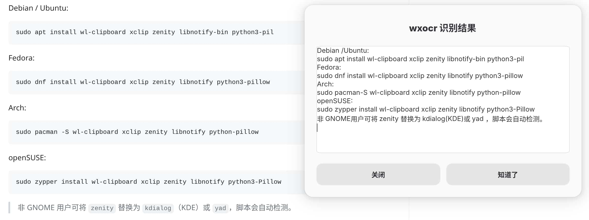

# clipocr-linux

Linux 桌面环境下的剪贴板 OCR 工具。复制截图 / 网页图片后运行脚本，识别结果自动弹出对话框并回写剪贴板。

> 仅支持 Linux（Wayland / X11），Windows 与 macOS 不可用。

```
截图 → 快捷键 → 弹窗显示文字 + 已复制到剪贴板
```

## 截图



## 依赖

| 组件 | 说明 |
|------|------|
| `python3` | 3.8+, 纯标准库，无 pip 依赖 |
| `wl-clipboard` | Wayland 环境下的剪贴板读写 (`wl-paste` / `wl-copy`) |
| `xclip` | X11 环境下的剪贴板读写 |
| `zenity` / `kdialog` / `yad` | 对话框工具，三选一即可 |
| `notify-send` | 桌面通知（libnotify） |
| `Pillow` | 可选，如安装则会自动将非 PNG 格式转为 PNG |

Debian / Ubuntu:

```
sudo apt install wl-clipboard xclip zenity libnotify-bin python3-pil
```

Fedora:

```
sudo dnf install wl-clipboard xclip zenity libnotify python3-pillow
```

Arch:

```
sudo pacman -S wl-clipboard xclip zenity libnotify python-pillow
```

openSUSE:

```
sudo zypper install wl-clipboard xclip zenity libnotify python3-Pillow
```

> 非 GNOME 用户可将 `zenity` 替换为 `kdialog`（KDE）或 `yad`，脚本会自动检测。

## 安装

```bash
curl -O https://raw.githubusercontent.com/hellodk34/clipocr-linux/main/clipocr-linux.sh
chmod +x clipocr-linux.sh
```

或直接 clone 仓库后把 `clipocr-linux.sh` 放到 `PATH` 里：

```bash
sudo cp clipocr-linux.sh /usr/local/bin/clipocr-linux
```

## 配置 OCR 后端

clipocr-linux 依赖一个 WeChat OCR REST API 服务。需要自行部署后端，或使用已有的社区实例。

### 环境变量

| 变量 | 默认值 | 说明 |
|------|--------|------|
| `WXOCR_API_URL` | `http://example:5000/ocr` | OCR 服务地址 |
| `WXOCR_DIALOG_WIDTH` | `700` | 结果弹窗宽度 |
| `WXOCR_DIALOG_HEIGHT` | `500` | 结果弹窗高度 |

示例——指向自部署的后端：

```bash
export WXOCR_API_URL="http://localhost:5000/ocr"
./clipocr-linux.sh
```

也可以写入 `~/.bashrc` 或 GNOME 快捷键的启动命令中。

## 使用

```bash
# 1. 复制一张图片到剪贴板（截图 / 浏览器右键"复制图片"）
# 2. 终端运行
./clipocr-linux.sh

# 或通过快捷键一键触发
```

## 绑定系统快捷键

### GNOME

1. 打开 **设置 → 键盘 → 键盘快捷键 → 查看及自定义快捷键 → 自定义快捷键**
2. 点击 **+** 添加
3. 名称: `OCR 识别`
4. 命令: `/path/to/clipocr-linux.sh`
5. 设置快捷键（推荐 `Alt+O`）

### KDE Plasma

1. **系统设置 → 快捷键 → 自定义快捷键 → 编辑 → 新建 → 全局快捷键 → 命令/URL**
2. 触发器: 设置组合键
3. 动作: `/path/to/clipocr-linux.sh`

### 其他桌面 / 窗口管理器

将脚本绑定到你使用的热键工具即可，例如：

- Sway / Hyprland: `bindsym $mod+Shift+O exec /path/to/clipocr-linux.sh`
- i3: `bindsym $mod+Shift+O exec /path/to/clipocr-linux.sh`
- xbindkeys: 在 `~/.xbindkeysrc` 中添加映射

## 跨平台支持矩阵

| 环境 | 剪贴板读取 | 对话框 | 通知 |
|------|-----------|--------|------|
| GNOME (Wayland) | wl-paste | zenity | notify-send |
| KDE (Wayland) | wl-paste | kdialog | notify-send |
| GNOME (X11) | xclip | zenity | notify-send |
| KDE (X11) | xclip | kdialog | notify-send |
| XFCE / MATE | xclip | zenity / yad | notify-send |
| Sway / Hyprland | wl-paste | zenity / yad | notify-send |
| i3 / dwm | xclip | yad / 终端 | notify-send |

> 以上为推荐搭配，脚本会按 `zenity → kdialog → yad → 终端` 的优先级自动选择可用工具。

## 致谢

本项目的前端工具为原创实现。其调用的 OCR 识别能力得益于社区先驱者对某国民级聊天软件内置 OCR 引擎的研究与容器化封装。在此向前辈的工作(`golangboy/wxocr`)致意。

## 许可证

MIT
